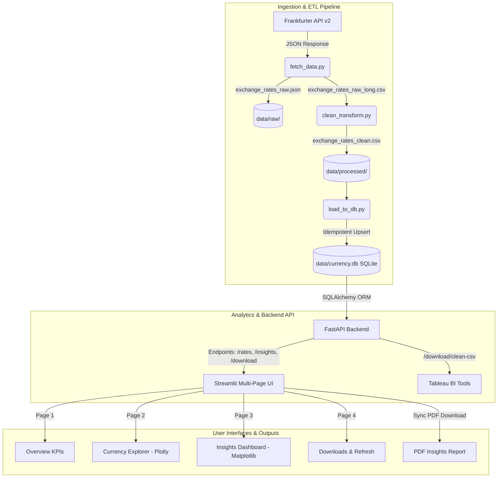

# 💱 Currency Exchange Insights Platform
### Frankfurter API ➔ pandas ETL ➔ FastAPI Backend ➔ Streamlit Dashboard ➔ Tableau

---

[](https://www.python.org/)
[](https://fastapi.tiangolo.com/)
[](https://streamlit.io/)
[](https://pandas.pydata.org/)
[](https://www.sqlite.org/)
[](https://www.tableau.com/)

---

## 📖 Project Overview

This project is a production-grade **Currency Exchange Insights Platform** built as a Capstone project. It implements a complete, end-to-end data engineering and analytics loop:
1. **ETL Pipeline**: Ingests, processes, cleans, and stores 1 year of historical exchange rate data from the **Frankfurter API (v2)**.
2. **Database Asset**: Builds a self-contained, queryable **SQLite database** serving as the platform's reusable data asset.
3. **Exploratory Data Analysis (EDA)**: Conducts detailed analytics using **Python Notebooks, SQL window functions, and Excel pivot tables**.
4. **FastAPI Backend**: Serves custom endpoints for raw data, rolling volatility rankings, trend direction indicators, server-side Matplotlib chart rendering, and synchronized multi-page PDF generation.
5. **Streamlit Multi-page Dashboard**: Provides an interactive analytics portal with Plotly-based currency exploration, custom date-range selection, automated textual commentary, and downloads.
6. **Data Refresh & Pruning**: Features a secure admin interface to incrementally refresh new exchange rates while maintaining a strict rolling 365-day database retention window.

---

## 🏗️ System Architecture & Data Flow

The platform is designed with a **decoupled client-server architecture**. The Streamlit frontend acts as a pure client, communicating exclusively with the FastAPI backend via HTTP requests. This isolates the database access to the backend API layer.



---

## 📦 Repository Structure

The workspace is organized into logical directories separating the pipeline, analysis, backend, frontend, and data assets:

```
currency-insights-capstone/
├── README.md                           # This interactive README
├── pyproject.toml                      # Project metadata & package configurations
├── requirements.txt                    # Auto-generated dependency lockfile
├── data/
│   ├── raw/                            # Untouched raw JSON data pulls (audit trail)
│   ├── processed/
│   │   ├── exchange_rates_raw_long.csv # Raw long-format CSV before imputation
│   │   └── exchange_rates_clean.csv    # Cleaned, calendar-reindexed, engineered dataset
│   └── currency.db                     # SQLite database (reusable queryable asset)
│
├── data_pipeline/
│   ├── fetch_data.py                   # Pulls 1-year historical rates from Frankfurter v2
│   ├── clean_transform.py              # pandas cleaning, gap-handling, and feature engineering
│   ├── load_to_db.py                   # Creates schemas and performs idempotent database loads
│   └── capstone_project_plan.md        # Technical architecture design and build plan
│
├── analysis/
│   ├── eda_python.ipynb                # Jupyter notebook showing correlation, distributions & trends
│   ├── eda_sql_queries.sql             # Advanced SQL queries demonstrating analytical functions
│   └── currency_pivot_analysis.xlsx    # Excel-based pivots, Sparklines, and conditional heatmaps
│
├── backend/
│   ├── main.py                         # FastAPI server initialization and CORS config
│   ├── database.py                     # SQLAlchemy database connection and session management
│   ├── models.py                       # SQLAlchemy ORM schemas (ExchangeRate, Currency)
│   ├── schemas.py                      # Pydantic validation schemas for API responses
│   ├── routers/
│   │   ├── admin.py                    # Admin API keys and rolling refresh trigger
│   │   ├── downloads.py                # CSV stream and PDF report generation endpoints
│   │   ├── insights.py                 # Summary stats, trend, volatility, and chart routes
│   │   └── rates.py                    # Raw, filtered, and latest exchange rate query routes
│   └── services/
│       ├── insight_engine.py           # Core statistics and pandas analytics computations
│       ├── chart_engine.py             # Headless Matplotlib visual generators
│       ├── refresh_service.py          # Incremental data fetch, merge, and database pruning
│       └── report_builder.py           # Multi-page PDF report compilation
│
└── frontend/
    ├── app.py                          # Streamlit application entrypoint (Overview Page)
    ├── pages/
    │   ├── 2_Currency_Explorer.py      # Plotly timeline interactive chart explorer
    │   ├── 3_Insights_Dashboard.py     # Analytics dashboard with auto commentary
    │   └── 4_Downloads.py              # Export tools for CSVs, reports, and Tableau tips
    └── utils/
        ├── api_client.py               # Streamlit-side cached client library
        └── sidebar.py                  # Standard sidebar component with data refresh trigger
```

---

## ⚡ Quick Start: Installation & Execution

Follow these steps to set up the project locally:

### 1. Environment Setup
Make sure you are using Python 3.13+. It is recommended to set up a virtual environment:
```bash
# Create a virtual environment
python -m venv .venv

# Activate the virtual environment
# On Windows (PowerShell):
.venv\Scripts\Activate.ps1
# On macOS/Linux:
source .venv/bin/activate

# Install all dependencies
pip install -r requirements.txt
```

### 2. Run the ETL Ingestion Pipeline
If you want to fetch a fresh set of historical data, run the scripts in order:
```bash
# Step 1: Fetch raw JSON from Frankfurter v2 API
python data_pipeline/fetch_data.py

# Step 2: Clean and engineer features with pandas
python data_pipeline/clean_transform.py

# Step 3: Load the data into the SQLite database
python data_pipeline/load_to_db.py
```

### 3. Start the FastAPI Backend
Launch the backend server locally. It will start at `http://localhost:8000`:
```bash
# Start the FastAPI server using the development server
fastapi dev backend/main.py
```
> [!TIP]
> You can visit the interactive Swagger API documentation at [http://localhost:8000/docs](http://localhost:8000/docs) to test and review endpoints.

### 4. Launch the Streamlit Frontend
In a separate terminal, start the Streamlit application:
```bash
streamlit run frontend/app.py
```
This will spin up a web server at `http://localhost:8501`. Go ahead and open it in your browser!

---

## ⚙️ Ingestion & ETL Pipeline (Phase 1)

The data pipeline utilizes **pandas** to query the API, restructure the data, compute indicators, and load it into SQLite:

1. **`fetch_data.py`**
   - Fetches 1 year of historical exchange rates relative to a base currency (default: `USD`).
   - Uses the **Frankfurter API v2** (`/v2/rates`), which outputs flat long-format JSON (`{date, base, quote, rate}`).
   - Saves the raw JSON to [data/raw/](file:///c:/Users/hp/Desktop/Ganit%20Capstone/data/raw) and unprocessed long-format CSV to [data/processed/exchange_rates_raw_long.csv](file:///c:/Users/hp/Desktop/Ganit%20Capstone/data/processed/exchange_rates_raw_long.csv).

2. **`clean_transform.py`**
   - Casts columns to their appropriate types (`datetime`, `float`, etc.).
   - Drops duplicate rows.
   - **Calendar Reindexing**: Frankfurter (via ECB) only publishes on business days. The script expands each currency series to cover the full calendar range (including weekends and holidays), inserting `is_trading_day = 0` for non-publishing dates. Gaps are flagged as `NaN` rates.
   - **Feature Engineering**: Calculates moving averages, daily percentage changes, and rolling volatility.
     > [!WARNING]
     > **The Monday Return Gotcha**: Standard rolling functions computed directly on calendar-expanded series will compare Monday's rate against Sunday's `NaN` rate, resulting in a null return. The script resolves this by calculating daily percentage changes *specifically* on the trading-days-only subset before merging them back onto the full calendar index.
     - `daily_pct_change` = $\frac{Rate_{t} - Rate_{t-1}}{Rate_{t-1}}$ (calculated strictly on consecutive trading days).
     - `ma_7` and `ma_30` = 7-day and 30-day moving averages.
     - `volatility_30d` = 30-day rolling standard deviation of daily percentage changes.
     - Time dimensions: `day_of_week`, `month`, `is_month_end`.

3. **`load_to_db.py`**
   - Bootstraps the SQLite database [data/currency.db](file:///c:/Users/hp/Desktop/Ganit%20Capstone/data/currency.db).
   - Generates two primary tables: `exchange_rates` and `currencies`.
   - Uses a temporary staging table to implement **idempotent upserts** via `INSERT OR REPLACE` mapping on unique keys `(date, base_currency, target_currency)`.

---

## 🔍 Exploratory Data Analysis (Phase 2)

Deep-dive analytical exploration is split into three interfaces to satisfy different review stakeholders:

### 1. Jupyter Notebook ([analysis/eda_python.ipynb](file:///c:/Users/hp/Desktop/Ganit%20Capstone/analysis/eda_python.ipynb))
Provides comprehensive visual analytics using **matplotlib** and **seaborn**:
- **Time Series Line Plots**: Tracks price paths relative to USD over 12 months.
- **Distribution of Daily Returns**: Renders histograms and box plots to isolate extreme tail events and outliers.
- **Correlation Matrix**: Computes a heatmap tracking correlation coefficients of daily returns across major liquid currencies.
- **Rolling Volatility**: Pinpoints volatility shifts and regime changes across the year.
- **Seasonality check**: Analyzes performance differences on day-of-week and month-end flags.

### 2. SQL Analysis ([analysis/eda_sql_queries.sql](file:///c:/Users/hp/Desktop/Ganit%20Capstone/analysis/eda_sql_queries.sql))
Contains advanced SQL scripts demonstrating database querying capabilities. Shows window partition queries such as:
- **Month-over-Month Open/Close Change**:
  ```sql
  SELECT DISTINCT
      target_currency,
      strftime('%Y-%m', date) AS month,
      FIRST_VALUE(rate) OVER w AS month_open,
      LAST_VALUE(rate) OVER w AS month_close,
      ROUND((LAST_VALUE(rate) OVER w / FIRST_VALUE(rate) OVER w - 1) * 100, 2) AS month_pct_change
  FROM exchange_rates
  WHERE is_trading_day = 1
  WINDOW w AS (
      PARTITION BY target_currency, strftime('%Y-%m', date)
      ORDER BY date
      ROWS BETWEEN UNBOUNDED PRECEDING AND UNBOUNDED FOLLOWING
  );
  ```
- **Volatilities rank per month**: Ranks target currencies monthly using `RANK() OVER`.
- **Cumulative Return tracking**: Running returns from Day 1 using `FIRST_VALUE` to seed a "growth of $1" layout.

### 3. Excel Pivot Table ([analysis/currency_pivot_analysis.xlsx](file:///c:/Users/hp/Desktop/Ganit%20Capstone/analysis/currency_pivot_analysis.xlsx))
A business-focused spreadsheet featuring:
- Average exchange rates pivot tables broken down by month and currency.
- Sparklines depicting the historical rate path.
- Conditional formatting heatmaps capturing outsized daily swings.

---

## ⚡ FastAPI Backend Router API (Phase 3)

The backend layer, powered by **FastAPI** and **SQLAlchemy ORM**, serves raw data, calculated insights, and file downloads:

### Endpoint Catalog

| Tag | Method | Path | Description |
| :--- | :---: | :--- | :--- |
| **Rates** | `GET` | `/currencies` | Lists all supported currency codes and full names from the database lookup table. |
| **Rates** | `GET` | `/currencies/available` | Lists only the currencies that currently have active exchange rates recorded. |
| **Rates** | `GET` | `/rates` | Returns full/filtered exchange rate records. Query params: `base`, `target`, `start`, `end`. |
| **Rates** | `GET` | `/rates/latest` | Returns the most recent trading day's rates for all target currencies. |
| **Insights** | `GET` | `/insights/summary` | Yields high-level KPIs: date window, count, best/worst performer, average overall volatility. |
| **Insights** | `GET` | `/insights/volatility` | Ranks all active currencies by their latest 30-day rolling volatility. |
| **Insights** | `GET` | `/insights/correlation` | Computes a Pearson correlation matrix of daily returns. |
| **Insights** | `GET` | `/insights/trend/{currency}` | Detects currency momentum (e.g. `up`, `down`, `flat`) based on 7-day and 30-day MA crossovers. |
| **Insights** | `GET` | `/insights/charts/{chart_name}` | Dynamically plots and streams Matplotlib charts as `image/png` bytes (`trend`, `volatility`, `correlation`, `top_movers`). |
| **Downloads** | `GET` | `/download/clean-csv` | Streams the long-format `exchange_rates_clean.csv` directly. |
| **Downloads** | `GET` | `/download/wide-csv` | Pivots data into wide-format (dates in rows, currencies in columns) and streams the CSV. |
| **Downloads** | `GET` | `/download/insights-report`| Generates and streams a professional multi-page PDF report with dynamic summary tables and graphics. |
| **Admin** | `POST`| `/admin/refresh` | **Sync Trigger**: Fetches new rates, computes derived stats, and deletes rows older than 365 days. |

---

## 💻 Streamlit Multi-Page Frontend (Phase 4)

The front-end user interface is structured into four main pages to guide users through the data:

```
frontend/
├── app.py                     # Page 1: Platform Overview (Headline KPIs and metrics)
└── pages/
    ├── 2_Currency_Explorer.py # Page 2: Timeline Viewer (Plotly graphs, MAs, and raw tables)
    ├── 3_Insights_Dashboard.py# Page 3: Visual Analytics (Dynamic backend charts + automatic comments)
    └── 4_Downloads.py         # Page 4: Export Center (CSV/PDF downloads and BI configurations)
```

### Key UI Features
* **Decoupled Architecture**: Communicates only with the FastAPI server URL (set via `API_URL` env variable), making it easy to containerize or host separately.
* **Cached Ingestion**: Employs Streamlit's `@st.cache_data` caching to limit repeat API calls and enhance response times.
* **Synchronized Reporting**: Generating and downloading the PDF report returns identical, fresh chart assets since the report builder and the UI call the exact same backend Matplotlib engine.
* **Synced In-App Refresh**: The sidebar contains a **🔄 Refresh data** module. Clicking it makes an authenticated POST request to the API, clears the Streamlit cache, and updates the dashboard immediately with the newly fetched rates.

---

## 📊 Tableau BI Dashboard (Phase 5)

The platform prepares files in format ready to connect directly to **Tableau**:
* **Long Format Layout**: The downloadable clean CSV file (`exchange_rates_clean.csv`) conforms to standard relational formats (`date, base_currency, target_currency, rate, ...`). This is the ideal structure for BI software, avoiding the need for pivoting or cleaning in Tableau.
* **Packaged Workbooks**: A packaging workbook template can be connected using the `Text File` connector pointed to the downloaded clean CSV file.
* **Recommended Dashboards**:
  1. **Historical Trend Path**: Rate vs Date, filterable by target currency.
  2. **Volatility League**: Horizontal bar chart comparing rolling volatilities.
  3. **Correlation Matrix Heatmap**: Displays dependencies between currency behaviors.
  4. **Performers BANs**: Big Active Numbers (KPI cards) showing % changes over the period.

---

## 🎯 Key Analytical Insights (USD Base)

Based on the trailing 1-year historical window analyzed during the Capstone pipeline:

* **Stable Pegs (Zero Volatility)**: Currencies like the UAE Dirham (`AED`), Hong Kong Dollar (`HKD`), and Saudi Riyal (`SAR`) show flat volatility lines. This indicates their official pegs to the USD, showing consistent, narrow bands close to zero standard deviation.
* **Highest Volatility Candidates**: The Argentine Peso (`ARS`) and Turkish Lira (`TRY`) exhibit the highest rolling standard deviations, driven by structural adjustments and macroeconomic fluctuations. Among major floating currencies, the Japanese Yen (`JPY`) and South African Rand (`ZAR`) show high volatility peaks.
* **EUR-GBP Trailing Correlation**: The Euro (`EUR`) and British Pound (`GBP`) exhibit a high positive correlation (typically $\ge 0.85$ on daily returns), showing that European currencies tend to move together against the USD.
* **Trend Crossover Momentum**: The 7-day vs. 30-day simple moving average crossover provides an effective trend signal. A 7-day MA above a 30-day MA signals upward target currency momentum (USD weakening), while a cross below denotes target currency deprecation (USD strengthening).

---

## 🛡️ Key Design Decisions

> [!NOTE]
> **Decoupled Client-Server Layout**
> Streamlit does not query SQLite directly. decopling the database from the UI allows you to replace or upgrade the database or API later without needing to change the frontend.

> [!TIP]
> **Idempotent Ingestion & Incremental Loading**
> The `load_to_db.py` pipeline utilizes a staging table layout with an SQLite `INSERT OR REPLACE` unique constraint on `(date, base_currency, target_currency)`. This ensures that even if a pipeline job runs multiple times, existing records are updated rather than duplicated.

> [!IMPORTANT]
> **Handling Gaps and Gaps-Calculations**
> Gaps in exchange rate listings on weekends and holidays are handled by reindexing the dates and adding a boolean `is_trading_day` flag. Daily percentage changes and rolling metrics are calculated *specifically* on active trading days first to prevent weekend-adjacent Monday data from returning as null values. Gaps are then reintroduced as nulls in the calendar index for complete visual timelines.

> [!CAUTION]
> **Rolling Window Retention Management**
> Rather than letting the database grow indefinitely, the `/admin/refresh` routine automatically deletes database rows that fall outside the 365-day retention window relative to the execution date. This limits storage requirements and keeps query speeds optimal.

---
*Developed as part of the Ganit Capstone curriculum.*
